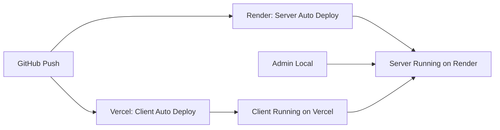

# デプロイガイド

## 概要

このクイズシステムは以下の3つのコンポーネントで構成されています：

- **admin**: 管理画面（ローカルで実行）
- **client**: タブレット用ボタンUI（Vercelにデプロイ可能）
- **server**: WebSocketサーバー（Render/Railwayなどにデプロイ）

## 重要: Socket.IOとVercel

**serverはVercelにデプロイできません**。理由：
- VercelはサーバーレスでWebSocket（Socket.IO）の永続接続をサポートしていない
- 代わりに**Render**、**Railway**、**Fly.io**などを使用

**clientはVercelにデプロイ可能**（静的+APIルートのみ）

---

## 1. Server のデプロイ（Render推奨）

### Renderでのデプロイ手順

1. **Renderアカウント作成**
   - https://render.com にアクセス
   - GitHubでサインアップ

2. **新しいWeb Serviceを作成**
   - Dashboard → "New" → "Web Service"
   - リポジトリを接続（emkc-quiz）

3. **設定**
   ```
   Name: emkc-quiz-server
   Region: Singapore (または最寄り)
   Branch: main
   Root Directory: server
   Runtime: Node
   Build Command: npm install && npm run build
   Start Command: node dist/server.js
   ```

4. **環境変数を設定**
   ```
   SERVER_ONLY=true
   PORT=10000 (Renderが自動設定)
   ALLOWED_ORIGINS=https://your-client.vercel.app,https://your-admin-domain.com
   ```

5. **デプロイ**
   - "Create Web Service"をクリック
   - デプロイ完了後、URLをメモ（例: `https://emkc-quiz-server.onrender.com`）

### Railwayでのデプロイ（代替案）

1. **Railwayアカウント作成**
   - https://railway.app にアクセス

2. **新しいプロジェクト作成**
   - "New Project" → "Deploy from GitHub repo"
   - リポジトリを選択

3. **設定**
   ```
   Root Directory: server
   Build Command: npm install && npm run build
   Start Command: node dist/server.js
   ```

4. **環境変数**
   ```
   SERVER_ONLY=true
   ALLOWED_ORIGINS=https://your-client.vercel.app
   ```

---

## 2. Client のデプロイ（Vercel）

### 前提条件
- Serverがデプロイ済みであること
- ServerのURLを把握していること

### Vercelでのデプロイ手順

1. **Vercelアカウント作成**
   - https://vercel.com にアクセス
   - GitHubでサインアップ

2. **新しいプロジェクトをインポート**
   - Dashboard → "Add New" → "Project"
   - GitHubリポジトリ（emkc-quiz）を選択

3. **プロジェクト設定**
   ```
   Project Name: emkc-quiz-client
   Framework Preset: Next.js
   Root Directory: client
   Build Command: npm run build (自動検出)
   Output Directory: .next (自動検出)
   Install Command: npm install (自動検出)
   ```

4. **環境変数を設定**
   ```
   NEXT_PUBLIC_SERVER_URL=https://emkc-quiz-server.onrender.com
   ```

5. **デプロイ**
   - "Deploy"をクリック
   - デプロイ完了後、URLをメモ（例: `https://emkc-quiz-client.vercel.app`）

6. **Serverの環境変数を更新**
   - RenderのダッシュボードでServerの環境変数を更新
   ```
   ALLOWED_ORIGINS=https://emkc-quiz-client.vercel.app,http://localhost:3000
   ```
   - Serverを再デプロイ

---

## 3. Client の設定変更

デプロイ前に、clientのSocket.IO接続先を環境変数で設定できるようにします。

### `client/lib/socket.ts` を更新

```typescript
import { io, Socket } from "socket.io-client";

const SOCKET_URL = process.env.NEXT_PUBLIC_SERVER_URL || "http://localhost:3001";

class SocketManager {
    private socket: Socket | null = null;

    connect() {
        if (!this.socket) {
            this.socket = io(SOCKET_URL, {
                transports: ["websocket", "polling"],
                reconnection: true,
                reconnectionDelay: 1000,
                reconnectionDelayMax: 5000,
                reconnectionAttempts: 5,
            });
        }
        return this.socket;
    }
    // ... 残りのコード
}
```

### ローカル開発用 `.env.local`

```bash
# client/.env.local
NEXT_PUBLIC_SERVER_URL=http://localhost:3001
```

---

## 4. Admin の設定（ローカル実行）

Adminはローカルで実行するため、デプロイ不要です。

### `.env.local` を作成

```bash
# admin/.env.local
NEXT_PUBLIC_SERVER_URL=https://emkc-quiz-server.onrender.com
```

### 実行

```bash
cd admin
npm run dev
```

---

## デプロイフロー全体



---

## トラブルシューティング

### CORS エラー
- Serverの`ALLOWED_ORIGINS`にClient/AdminのURLが含まれているか確認
- `https://` プロトコルを忘れずに

### WebSocket接続エラー
- RenderのFree Planは15分間アクセスがないとスリープします
- 初回接続に時間がかかる場合があります（スリープ解除）

### ビルドエラー
- `npm install`が正しく実行されているか確認
- `package.json`の依存関係が正しいか確認

---

## コスト

### Render
- Free Plan: 月750時間（1つのサービス）
- 制限: 15分間アクセスなしでスリープ

### Vercel
- Hobby Plan: 無料
- 制限: 月100GB帯域幅、100GBビルド時間

### Railway
- Free Trial: $5クレジット
- 以降従量課金

---

## 推奨構成

**開発環境:**
```
Admin: localhost:3000
Client: localhost:3002
Server: localhost:3001
```

**本番環境:**
```
Admin: ローカル（localhost:3000）
Client: https://emkc-quiz-client.vercel.app
Server: https://emkc-quiz-server.onrender.com
```

---

## 次のステップ

1. ✅ Serverをデプロイ（Render/Railway）
2. ✅ ServerのURLを取得
3. ✅ ClientのSocket.IO設定を更新
4. ✅ ClientをVercelにデプロイ
5. ✅ ServerのCORS設定を更新
6. ✅ 動作確認

---

## 参考リンク

- [Render Documentation](https://render.com/docs)
- [Vercel Documentation](https://vercel.com/docs)
- [Railway Documentation](https://docs.railway.app/)
- [Socket.IO Documentation](https://socket.io/docs/v4/)
